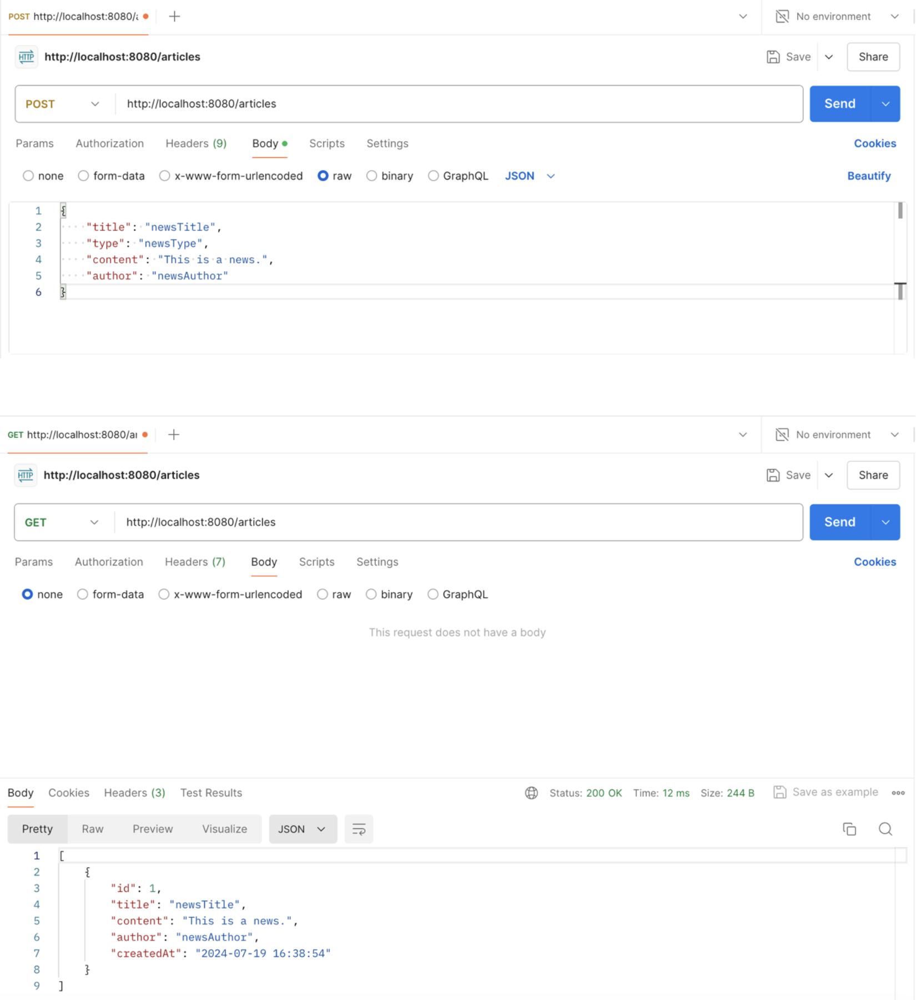
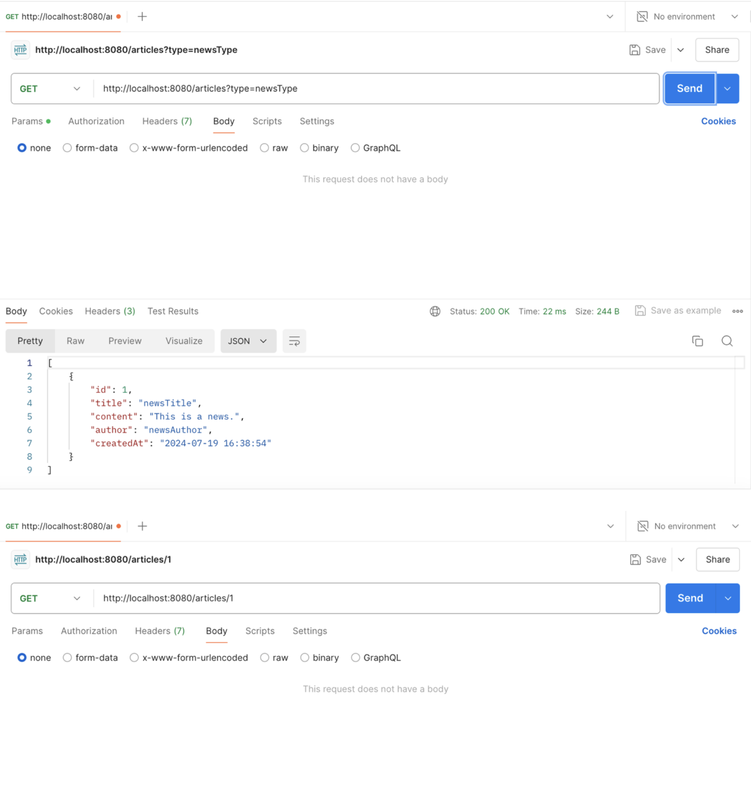
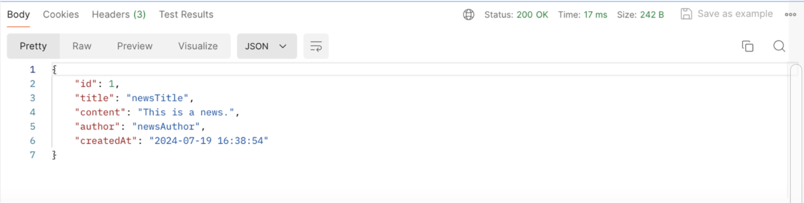
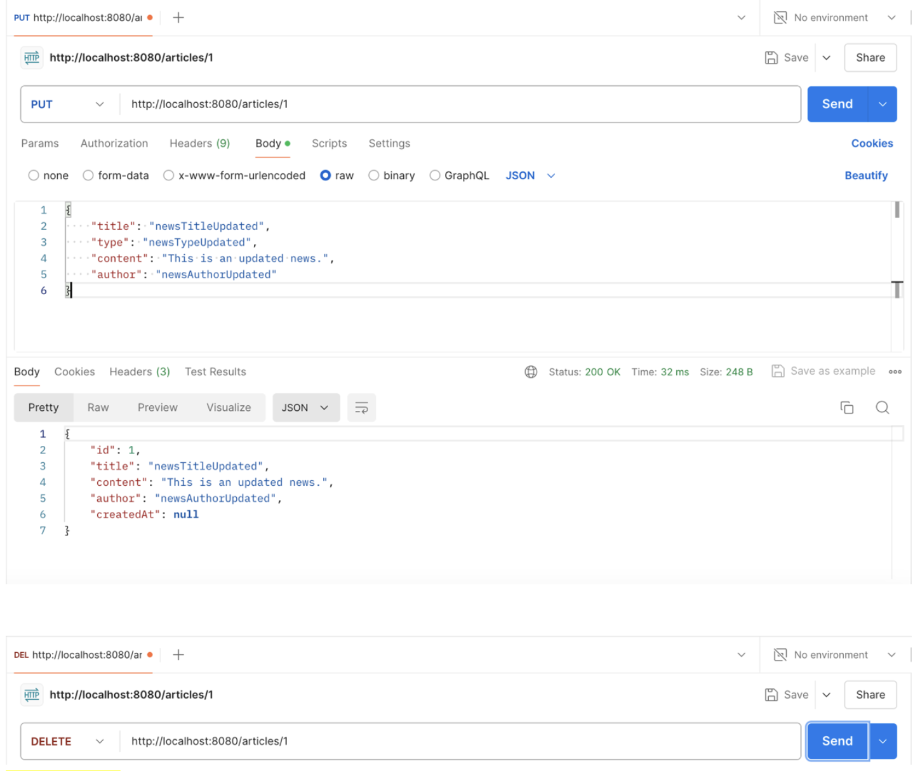

# wk4-mybatisplus
- https://github.com/baomidou/mybatis-plus-samples
- https://www.imooc.com/learn/1130
- https://www.imooc.com/learn/1171
- https://www.imooc.com/learn/1294

Springboot& MyBatis-Plus helps to build a backend portal, requiring RESTful specifications for communication and Postman API for testing. The portal should include the following CRUD operations:
- GET the whole list of news articles
- GET the certain piece of news article by news type
- GET the details of the certain piece of news article
- POST a new piece of news article
- UPDATE(PUT) the details of the certain piece of news article by its ID
- DELETE the certain piece of news article by its ID
- **GET the comments of the certain piece of news article**
- **POST a new comment of the certain piece of news article**
- GET splash ad
- GET home-popup ad
- **GET user info**
- **REGISTER(POST) a new user**
- **UPDATE(PUT) user info**
- **DELETE user**

As followed by the Fig.1 below.

    
    
    
    
    
Fig.1 MyBatis-Plus CRUD

